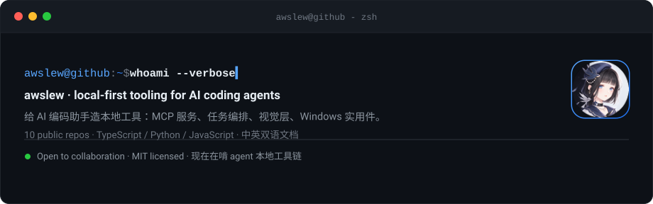
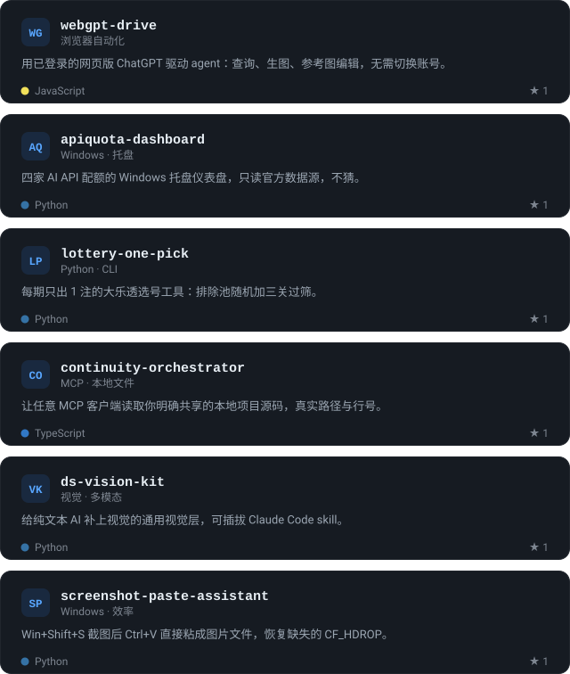
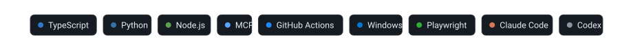

<picture>
  <source media="(prefers-color-scheme: dark)" srcset="./assets/hero-dark.svg">
  <source media="(prefers-color-scheme: light)" srcset="./assets/hero-light.svg">
  
</picture>

---

## 现在在做什么

给 AI 编码助手造**本地工具**。不是又一个 API 封装，而是那些你必须自己写一遍的东西：让 agent 读得到、跑得久、看得见、用得顺手。

- **检索要能落地** —— 中文查询走国内引擎融合，英文走国际链，RRF 交叉校验，不要 key
- **作业要能跑久** —— 一次 MCP 调用被截断在 10 秒，那就把它变成后台跑几小时的作业
- **配额要能看见** —— 四家 API 的剩余额度从官方数据源读出来，放在托盘上
- **纯文本模型要看得见** —— 给 DeepSeek / GLM 这类模型补一层视觉

所有项目 **MIT 许可**、**中英双语文档**、**Windows 上实测过**。

---

## 精选开源

<picture>
  <source media="(prefers-color-scheme: dark)" srcset="./assets/projects-dark.svg">
  <source media="(prefers-color-scheme: light)" srcset="./assets/projects-light.svg">
  
</picture>

共 9 个公开仓库：

- `webgpt-drive` JavaScript · 用已登录的网页版 ChatGPT 驱动 agent：查询、生图、参考图编辑，无需切换账号。
- `apiquota-dashboard` Python · 四家 AI API 配额的 Windows 托盘仪表盘，只读官方数据源，不猜。
- `lottery-one-pick` Python · 每期只出 1 注的大乐透选号工具：排除池随机加三关过筛。
- `continuity-orchestrator` TypeScript · 让任意 MCP 客户端读取你明确共享的本地项目源码，真实路径与行号。
- `ds-vision-kit` Python · 给纯文本 AI 补上视觉的通用视觉层，可插拔 Claude Code skill。
- `screenshot-paste-assistant` Python · Win+Shift+S 截图后 Ctrl+V 直接粘成图片文件，恢复缺失的 CF_HDROP。
- `codex-auto-resume-trio` TypeScript · Codex 额度中断后自动续跑，附只读状态页与四家 API 配额托盘。
- `codex-job-orchestrator` TypeScript · Codex-led async MCP job orchestrator: your Codex session dispatches long-running jobs to Claude Code, Codex subagents or DeepSeek Harness, then waits event-driven. Codex 主导的本地异步 MCP 任务编排器：主会话派活给 Claude Code / Codex 子代理 / DeepSeek Harness，事件驱动等待，作业可断线恢复。
- `web-search-mcp` JavaScript · 免费多引擎联网检索 MCP：中文走国内引擎融合，英文走国际链，不用 API key。

---

## 技术栈

<picture>
  <source media="(prefers-color-scheme: dark)" srcset="./assets/tools-dark.svg">
  <source media="(prefers-color-scheme: light)" srcset="./assets/tools-light.svg">
  
</picture>

---

 

35 commits · 9 repos · 每日由 GitHub Actions 自动更新

